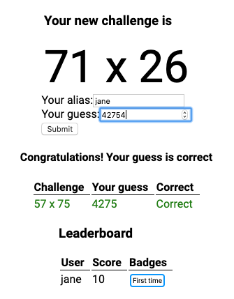

# Learn Microservices with Spring Boot - Chapter 6

This repository contains the source code of the practical use case described in the book [Learn Microservices with Spring Boot (2nd Edition)](https://tpd.io/book-extra).

The book follows a pragmatic approach to building a Microservice Architecture. You start with a small monolith and examine the _pros_ and _cons_ that come with a move to microservices. 

## Chapter 6 version

In Chapter 6, you **enter into the world of microservices** with a first approach that uses synchronous processing and _orchestration_ from the Multiplication microservice. As the book explains, **this approach has many issues**: tight coupling, domain pollution, etc. Yet we covered it to learn why it's important to embrace _Asynchronous Processing_ and _Eventual Consistency_ in microservice architectures.


The main concepts included in this chapter are:

* Monolith vs. Microservices: Pros and Cons
* Starting with a _Small Monolith_
* Non-Functional Requirements in Microservices
* Building the Gamification microservice
* Connecting microservices with synchronous interfaces
* Analysis: Transactionality, Eventual Consistency, Fault Tolerance

As usual, you go through a practical implementation of a microservice architecture that evolves to show you the real problems, and the tools you can use to solve them.

The next figure shows the domain models after introducing the Gamification domain (in the new microservice):


Check the [Book's Web Page](https://tpd.io/book-extra) to see the complete list of chapters.

## Running the app

Requirements:

* JDK 14+
* Node.js v13.10+
* npm 6.13.7+

1. To start the Multiplication microservice, you can use the command line with the included Maven wrapper:
    ```bash
    multiplication$ ./mvnw spring-boot:run
    ```
2. To start the Gamification microservice, you do the same from its corresponding folder:
    ```bash
    gamification ./mvnw spring-boot:run
    ```
2. The React application can be started with npm. First, you need to download the dependencies with:
    ```bash
    challenges-frontend$ npm install
    ```
3. Then, you start the server with:
    ```bash
    challenges-frontend$ npm start
    ```

Once the backend and the fronted are started, you can navigate to `http://localhost:3000` in your browser and start resolving multiplication challenges. This time, you'll see the Leaderboard.



## Questions

* Do you have questions about how to make this application work?
* Did you get the book and have questions about any concept explained within this chapter?
* Have you found issues using updated dependencies?

Don't hesitate to create an issue in this repository and post your question/problem there. 

## About the book

Are you interested in building a microservice architecture from scratch? You'll face all the challenges of designing and implementing a distributed system one by one, and will be able to evaluate if it's the best choice for your system.

Visit [https://thepracticaldeveloper.com/learn-microservices-v2](https://tpd.io/book-extra) for all the details about the book.
